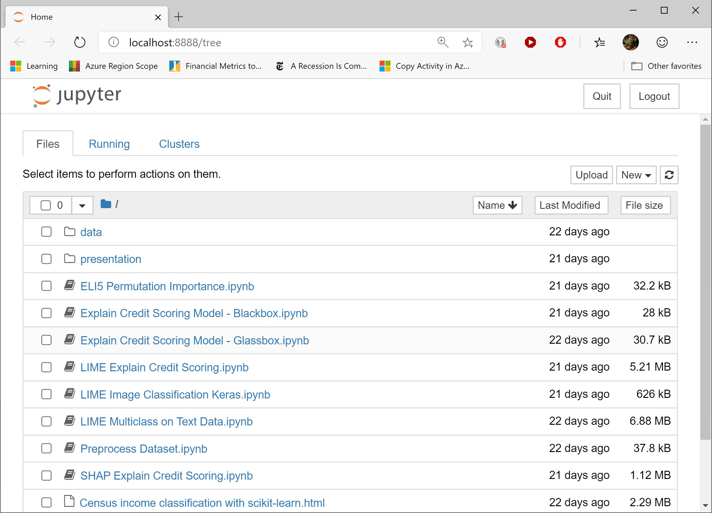

# Explaining ML Models 

This repo contains the code to support my *"Excuse Me, Why Has Your AI Denied My Loan? A Look at Machine Learning  Model Explainability"* talk. You can find the slides [here](./presentation/Sorin%20Peste%20-%20ML%20Model%20Explainability.pdf).

## Run The Notebooks Locally

1. Install [Anaconda](https://www.anaconda.com/).

2. Either clone or download a copy of this repository.

3. Open a command prompt and navigate to the root folder of your local copy of this repository.

4. Run the following command to create the environment with all its dependencies:

    ```conda env create -f explain_env.yml```

5. Run the following command to activate the environment:

    ```conda activate explain```

6. Once the environment is active, run `jupyter`:

    ```jupyter notebook```

That's it! You can now browse and open the notebook files from jupyter's web interface.

